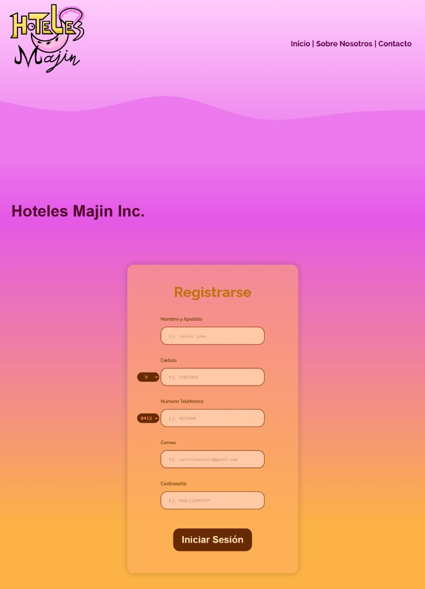
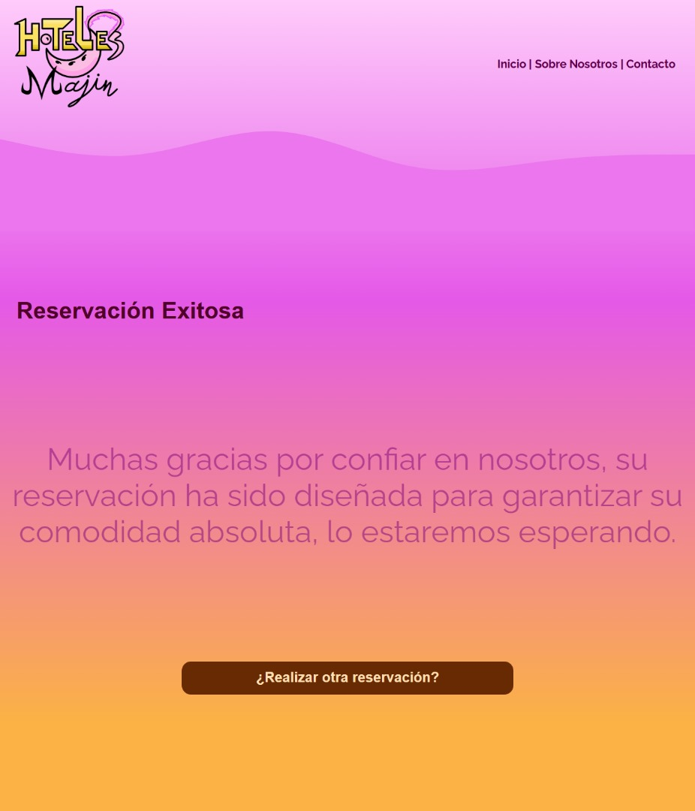

# Hotel Reservaciones


---

## Descripción del Proyecto

**Hotel Reservaciones** es una aplicación web que simula un sistema completo de reservas de hotel. Permite al usuario registrarse, seleccionar tipo de habitación, agregar servicios y aditamentos a la habitación, y definir fechas de reservación. Todo el proyecto está desarrollado únicamente con **HTML y CSS**, enfocándose en la organización, experiencia de usuario y presentación profesional.

El proyecto está diseñado para demostrar habilidades en **diseño web, organización de contenido y estructura de formularios**, ofreciendo una base funcional que podría ampliarse con tecnologías de backend en el futuro.





---

## Características Principales

* Registro de usuario con campos para nombre, cédula, número telefónico, correo y contraseña.
* Selección de tipo de habitación (Individual, Pareja, Familiar).
* Opciones para incluir mascotas.
* Selección de comidas y servicios adicionales (Desayuno, Almuerzo, Cena, Nevera de Bebidas, Cesta de Snacks).
* Aditamentos de habitación como Jacuzzi, Servicio a la Habitación y Climatizador.
* Elección de fechas de llegada y retirada con validaciones básicas.
* Interfaz limpia, organizada y visualmente atractiva con efectos gráficos tipo "wave".

---

## Estructura del Proyecto

```
hotel-reservaciones/
├── index.html              # Página principal con formulario de registro
├── reservar.html           # Página de selección de habitación y servicios
├── reservado.html          # Página de confirmación de reserva
├── estilos/                # Carpeta con archivos CSS
│   ├── estilos.css
│   ├── estilosreservar.css
│   ├── estilosreservacion.css
│   └── estilosreservado.css
├── imagenes/               # Recursos gráficos del proyecto
│   ├── Logo1.png
│   ├── favicon.ico
│   ├── jacuzzi.png
│   ├── servihabitacion.png
│   ├── climatizador.png
│   ├── perro.png
│   ├── check.png
│   └── uncheck.png
└── README.md               # Documentación del proyecto
```

---

## Cómo Utilizar el Proyecto

1. Clona el repositorio:

   ```bash
   git clone https://github.com/carlosluna1611/hotel-reservaciones.git
   ```
2. Abre los archivos `.html` en tu navegador web.
3. Comienza registrando un usuario en `index.html`.
4. Dirígete a `reservar.html` para seleccionar tipo de habitación, servicios, aditamentos y fechas.
5. Confirma la reservación en `reservado.html`.

> **Nota:** El proyecto es completamente portátil y no requiere instalación adicional.

---

## Tecnologías Utilizadas

* **HTML5**: Estructura y semántica del contenido.
* **CSS3**: Diseño visual, responsividad y efectos gráficos.

---

## Licencia

Este proyecto está bajo la **Licencia MIT**. Se permite usar, modificar y distribuir el proyecto siempre que se reconozca al autor original.
